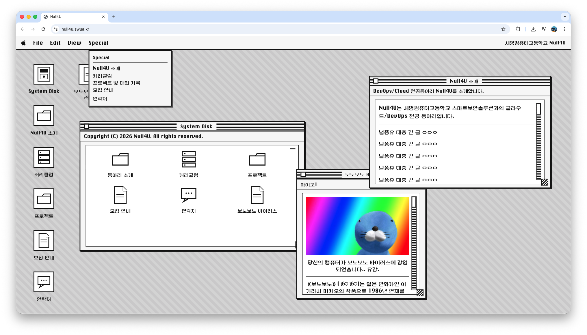
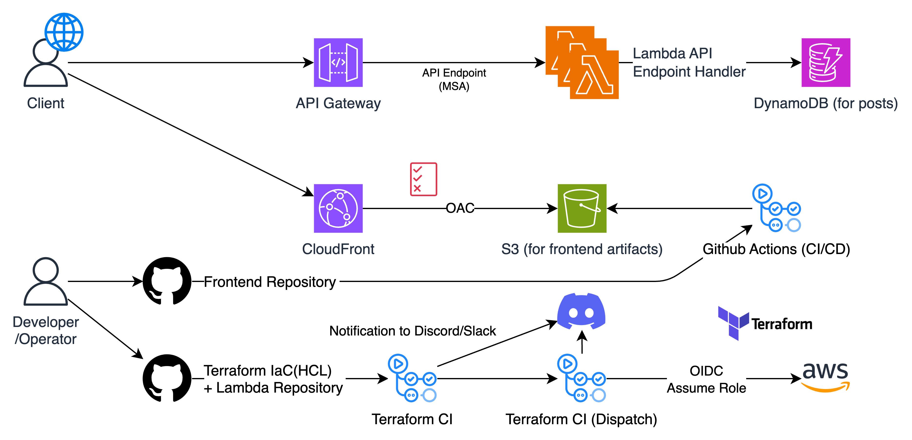

# Null4U



# Tech Stack (Frontend)

- React
- TypeScript
- Vite
- Tailwind CSS

# Project Architecture



See [serverless-iac repo](https://github.com/nullforu/serverless-iac) for more details.

# S3 Deployment (GitHub Actions + OIDC)

GitHub Actions uses OIDC to assume an IAM Role without long-lived access keys.

## GitHub Secrets

- `AWS_ROLE_ARN`: IAM Role ARN for OIDC (example: `arn:aws:iam::123456789012:role/gh-actions-null4u`)
- `AWS_REGION`: AWS region (example: `ap-northeast-2`)
- `S3_BUCKET`: Frontend artifact S3 bucket name (example: `null4u-frontend-bucket`)

## AWS Setup (IAM)

Create an IAM OIDC provider in AWS IAM:

- Role name: `gh-actions-null4u`
- Provider URL: `https://token.actions.githubusercontent.com`
- Audience: `sts.amazonaws.com`

Create an IAM Role with this trust policy (replace placeholders):

```json
{
    "Version": "2012-10-17",
    "Statement": [
        {
            "Effect": "Allow",
            "Principal": {
                "Federated": "arn:aws:iam::123456789012:oidc-provider/token.actions.githubusercontent.com"
            },
            "Action": "sts:AssumeRoleWithWebIdentity",
            "Condition": {
                "StringEquals": {
                    "token.actions.githubusercontent.com:aud": "sts.amazonaws.com",
                    "token.actions.githubusercontent.com:sub": "repo:<OWNER>/<REPO>:ref:refs/heads/main"
                }
            }
        }
    ]
}
```

Attach an IAM policy to the role that allows S3 sync (policy name: `GitHubActionsS3Access`):

```json
{
    "Version": "2012-10-17",
    "Statement": [
        {
            "Effect": "Allow",
            "Action": ["s3:ListBucket"],
            "Resource": "arn:aws:s3:::<BUCKET_NAME>"
        },
        {
            "Effect": "Allow",
            "Action": ["s3:PutObject", "s3:DeleteObject", "s3:PutObjectAcl"],
            "Resource": "arn:aws:s3:::<BUCKET_NAME>/*"
        }
    ]
}
```

# Contributors

- 김준영, [@yulmwu](https://github.com/yulmwu) - Maintainer
- 경대영, [rudeodud](https://github.com/rudeodud) - Bug reports and suggestions
- and more [Null4U](https://github.com/nullforu) members...
